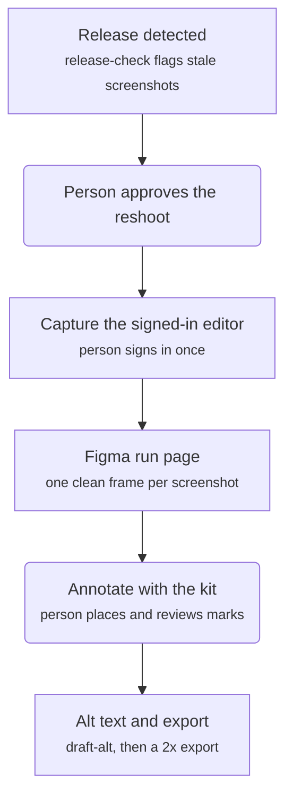
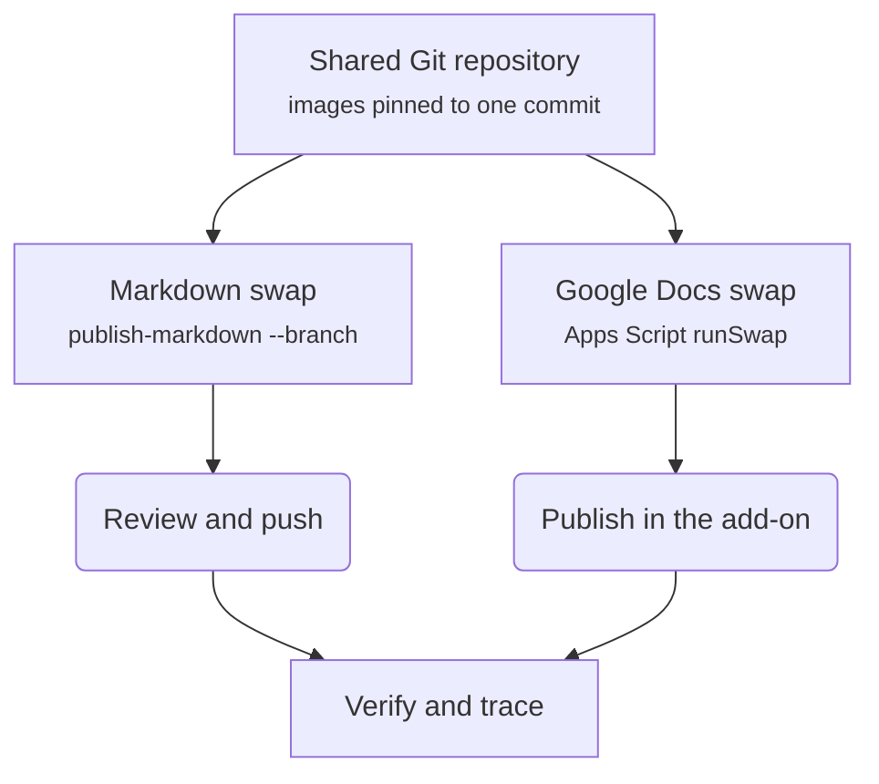

# How it works

The tool turns "P1 shipped a new version" into a reviewed batch of screenshot changes across every doc. People
decide what to reshoot, annotate, and publish; the tool does the capturing, checking, recording, and swapping.

## From a release to an annotated image

Square boxes are tool steps; rounded boxes are a person's decisions.

## From the repository to every doc

## The inventory is the source of truth

Every screenshot the docs need is one record in a git-tracked JSON file. The record says which release it
shows, the checksum of the exported image, where its frames live in Figma, which doc and heading embed it, its
caption and alt text, and whether the published copy was verified. Each status change is a one-step
transition the tool validates, so the history of a screenshot is a reviewable git log.

## Why images are pinned to commits

A release swap must mean the same bytes every time it runs. The Google Docs swap list names a full commit SHA
for every image, and the script refuses any image whose checksum differs from the list. Rolling back is
building the list from the earlier commit and running the swap again. The Markdown swap is a commit too:
image paths never change, so the diff shows each old and new image side by side.

## Why the docs embed the annotated frame

Each screenshot has two Figma frames: the clean capture and the annotated copy. The clean frame stays
untouched as evidence of what the editor showed; the annotated frame is what readers see. The inventory
records both node IDs, and `trace` fails if the annotated one is missing, so a docs image can't silently be
the unannotated capture.

## What stays manual, on purpose

- **Approving a reshoot:** a release doesn't always change what a screenshot shows.
- **Signing in:** the tool never handles credentials.
- **Annotating and reviewing marks:** judgment about what the reader needs to see.
- **Publishing:** Content Publisher has no publish API, and a person should see the page before it ships.
