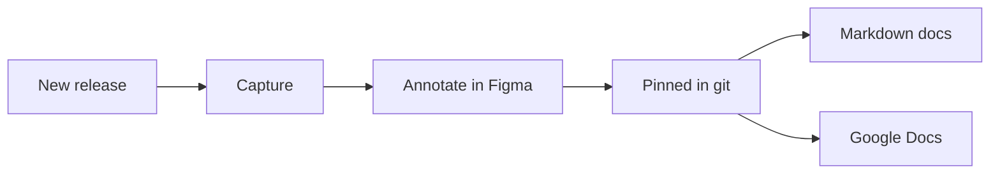

  

    
Screenshots to docs

    <h1>Keep every docs screenshot current, release after release</h1>
    
Capture the signed-in app, annotate in Figma with a shared kit, draft alt text from the marks, and swap the new images into Markdown and Google Docs from one reviewed commit.

    <a class="btn" href="{{ '/tutorial/first-swap.html' | relative_url }}">Try the tutorial</a>
    <a class="btn btn-outline" href="{{ '/how-to/set-up.html' | relative_url }}">Set up</a>
  

  

When an app ships a new version, the screenshots in its docs go stale. This tool turns a release into a reviewed
batch of screenshot changes, for the P1 editor, WordPress and Drupal admin screens, Content Publisher, public
websites, or any web app you add a [preset](reference/presets.html) for. People still decide what to reshoot, review the marks, and click Publish.

  <a class="card" href="{{ '/tutorial/first-swap.html' | relative_url }}">
    Tutorial · 10 minutes
    <h3>Your first release swap</h3>
    
Run the whole swap on sample data. No accounts needed.

  </a>
  <a class="card" href="{{ '/how-to/' | relative_url }}">
    How-to guides · with videos
    <h3>Run a release, step by step</h3>
    
From detecting a release to verifying every published image.

  </a>
  <a class="card" href="{{ '/reference/' | relative_url }}">
    Reference
    <h3>Commands, config, inventory, kit</h3>
    
Every flag, field, status, and annotation component.

  </a>
  <a class="card" href="{{ '/explanation/how-it-works.html' | relative_url }}">
    Explanation
    <h3>How it works</h3>
    
Why images are pinned to commits, and how alt text stays in step with the marks.

  </a>

