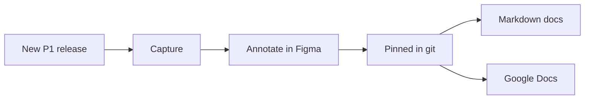

# P1 screenshots to docs

When P1 ships a new version, the screenshots in its docs go stale. This tool turns a release into a reviewed
batch of screenshot changes: it captures the signed-in editor, puts each run on a Figma page for annotation,
drafts alt text from the annotation marks, and swaps the new images into Markdown docs and Google Docs without
anyone inserting images by hand. People still decide what to reshoot, review the marks, and click Publish.

## Start here

- **New to the tool?** [Your first release swap](tutorial/first-swap.html) runs end to end on sample data in
  about ten minutes, with no accounts.
- **Setting up?** [Set up the tool](how-to/set-up.html): one command installs the capture tools, the Figma
  annotation kit, and both docs targets.
- **Running a release?** Follow the [how-to guides](how-to/) in order, from
  [Detect a release](how-to/detect-a-release.html) to [Verify and trace](how-to/verify.html). Each step has
  a short narrated video.
- **Looking something up?** [Commands](reference/commands.html), [Configuration](reference/configuration.html),
  [Inventory](reference/inventory.html), [Google Docs swap](reference/google-docs-swap.html),
  [Annotation kit](reference/annotation-kit.html).
- **Want the reasons?** [How it works](explanation/how-it-works.html), [Accessibility](explanation/accessibility.html),
  [Safety](explanation/safety.html).
