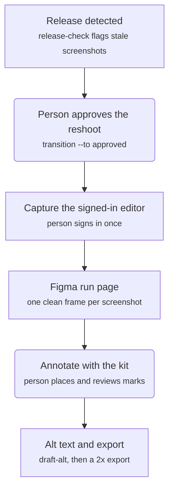
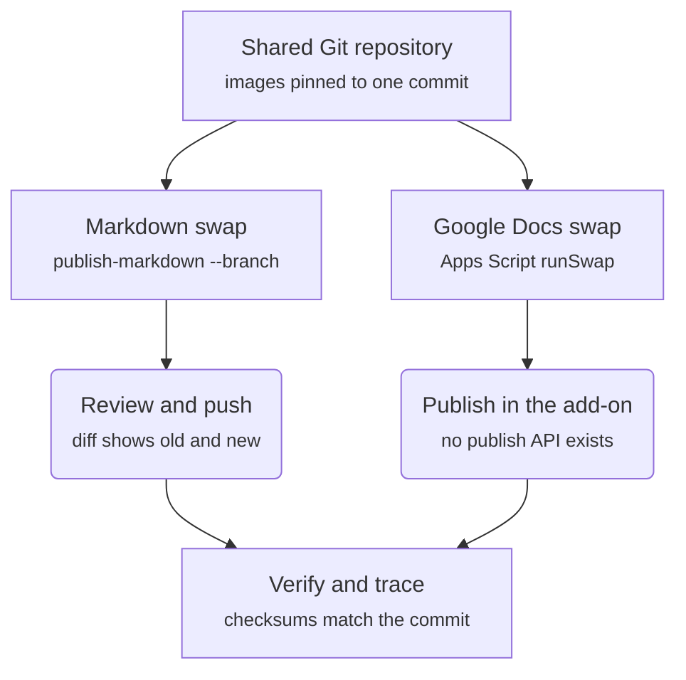

# Walkthrough: one release, from a new P1 version to every doc

This is the whole process in order, for a docs team member running it for the first time. Each step says
who does it, the command, what the command checks, and what you should see. Commands run from
`tools/p1-editor-screenshots-to-docs/`; `inv` below is short for
`node scripts/inventory.mjs --inventory <inventory file>`.

The process was rehearsed end to end on 2026-10-07 with a simulated release (0.16.0 to 0.20.0), a private
test docs repository, and a scratch Google Doc. Nothing was published. Each step names the narrated
video recorded during that run.

## The process at a glance

From a new release to an annotated, exported image (tool steps square, person steps rounded):



From the shared repository to every doc:



The first time an image goes into a Google Doc, a person inserts it and sets its alt text; every later
release, the swap script finds it by that alt text.

## Who does what

| Step                   | Person                                                                      | Tool or agent                                                     |
| ---------------------- | --------------------------------------------------------------------------- | ----------------------------------------------------------------- |
| Decide what to reshoot | Approves records                                                            | `release-check`, `transition`                                     |
| Sign in                | Signs in to P1 in the dedicated Chrome                                      | Never sees or stores credentials                                  |
| Capture, Figma page    | Reviews the gallery                                                         | `capture`, `record-capture`, `figma-plan`, Figma connector        |
| Annotate               | Places marks with the kit, reviews them                                     | Can copy marks from the previous release                          |
| Alt text               | Reads and approves the draft                                                | `draft-alt`                                                       |
| Export, hand off       |                                                                             | `figma-export` (or a manual 2x export), `record-asset`, `handoff` |
| Markdown docs          | Reviews and pushes the branch                                               | `publish-markdown --branch`                                       |
| Google Docs            | Inserts each image once, then authorizes the swap script and clicks Publish | `gdocs-manifest`, Apps Script `runSwap`                           |
| Verify                 |                                                                             | `record-publication`, `trace`                                     |

## 1. A release is detected (video 1)

```bash
inv list
inv release-check --registry --app <capture app folder>
inv release-check --version <new version>
inv transition --id <id> --to approved --release <new version>
```

- `release-check --registry` compares the SDK installed in the capture app with the latest published
  version, and warns when the app still runs the old one: screenshots show the installed UI.
- `release-check --version` lists every screenshot still captured for an older version as `BEHIND`, with
  the exact `transition` command to retarget it.
- Approving a record for the new release is the person's decision; nothing is captured without it.

## 2. Capture the new release (video 2)

```bash
inv brief --config <config> --release <new version> --out brief.json
node scripts/chrome.mjs --config <config>          # prints the command to start the dedicated Chrome
node scripts/capture.mjs --brief brief.json --config <config> --only <id> --out-dir <out>/validate
node scripts/capture.mjs --brief brief.json --config <config> --out-dir <out>/run1
inv record-capture --run <out>/run1 --assets-dir <assets>
```

- A person signs in to P1 in the dedicated Chrome. The capture refuses sign-in, loading, challenge,
  public-site, and wrong-workstream screens.
- Take one validation shot and look at it before the full run.
- `record-capture` stores each image's checksum, size, and release, and moves the records to `captured`.
  It refuses a run whose caption or alt text differs from the inventory (regenerate the brief).
- A navigation timeout fails that shot and records nothing; run the capture again.

## 3. The run in Figma (videos 3 and 4)

```bash
node scripts/make-gallery.mjs --dir <out>/run1          # review every shot side by side
node scripts/figma-plan.mjs --dir <out>/run1 --inventory <inventory> --config <config> --release <new version>
```

Then follow `figma-review.md`: run `figma-page.js` with `use_figma`, request upload URLs with
`upload_assets`, and upload with `scripts/figma-upload.mjs` (it refuses any host that isn't https on
`figma.com`). Each run is one page, `RUN-<date> · <run id>`, with one clean frame per screenshot.

## 4. Annotate with the kit (video 5)

- Build the annotated frame beside the clean one: a copy of the image rectangle only, named
  `[<id>] — <title> — <release> — annotated`.
- Drag marks from the kit's Assets panel: Highlight box, Step badge, Callout, Arrow, Redact for names
  and avatars. Every mark is nested inside the annotated frame so it exports with the image.
- **Name each step layer the way it should be read**: `Step 1: the Blocks panel`, not `Step 1: Blocks`.
  The alt text is drafted from these names.
- When the UI didn't change, copy the previous release's annotated frame and swap in the new image;
  check every redaction still covers what it should.

```bash
inv record-figma --id <id> --evidence uploaded --file-url <file url> --page-name "<run page>" \
  --node-id <clean frame node> --annotated-node-id <annotated frame node> --annotation-status complete
inv transition --id <id> --to annotated          # after a person reviews the marks
```

`--annotated-node-id` must be a different node from the clean frame; the handoff links it, and `trace`
fails without it.

## 5. Alt text from the marks (video 7b)

```bash
node scripts/draft-alt.mjs --marks <marks.json> [--subject "The P1 editor"]
node scripts/draft-alt.mjs --marks <marks.json> --id <id> --inventory <inventory> --apply
```

- `marks.json` is the annotated frame's layer names (a list, or the Figma REST nodes response).
- The draft numbers the areas in the same order as the badges: "The P1 editor with four numbered areas:
  1 the Blocks panel, 2 …".
- A person reads the draft. `--apply` saves it through `set-alt`, which runs the inventory's text checks.
  To change alt text by hand: `inv set-alt --id <id> --text "<alt text>"`.

## 6. Export and hand off (videos 6 and 7c)

```bash
FIGMA_TOKEN=... node scripts/figma-export.mjs --inventory <inventory> --status annotated --out <dir> --record --assets-dir <assets>
inv transition --id <id> --to handed_off
inv handoff --out handoff.md
```

- `figma-export` renders the annotated node at 2x through the Figma API and runs `record-asset`. Without
  a Figma token, export the annotated frame by hand (PNG, 2x) and run `inv record-asset --id <id> --file <png>`.
- The handoff lists each image's docs slot, caption, alt text, checksum, and the annotated frame's node.

## 7. Markdown docs (video 7a)

```bash
node scripts/publish-markdown.mjs --inventory <inventory> --assets-dir <assets> --repo <docs repo> --dry-run
node scripts/publish-markdown.mjs --inventory <inventory> --assets-dir <assets> --repo <docs repo> --branch screenshots/<release>
```

- The docs repo's `screenshots.map.json` maps each screenshot ID to the image file its pages embed.
- The swap copies the new image over the old file and updates the Markdown alt text, then commits only
  the changed files. It pushes nothing; a person reviews the diff and pushes the branch.

## 8. Google Docs (videos 7d and 7e)

**First time only (7d):** a person adds the image to the doc under the recorded heading and sets its alt
text (right-click the image, Alt text). From then on, the swap script finds it by that alt text.

**Every release (7e):**

```bash
# commit the new images to the shared repository first, then:
node scripts/gdocs-manifest.mjs --inventory <inventory> --repo <owner/name> --ref <commit with the images> --out release-swap/<release>.json
# commit and push the manifest
```

In the Apps Script project (`templates/gdocs-swap/Code.gs`), set the script properties
`MANIFEST_REPO`, `MANIFEST_PATH`, `MANIFEST_REF` (the commit with the manifest), and `GITHUB_TOKEN` (a
fine-grained token, read-only Contents on that one repository, entered by a person). Click
**Save script properties**. Then:

1. Run `dryRunSwap`. The first run asks the person to authorize Docs access and external requests.
   The log lists each entry: `would-replace`, `not-found`, `ambiguous`, or `checksum-mismatch`.
2. Run `runSwap`. Each match is replaced in place at the same width, with the alt text written.
3. A person clicks Publish in the Content Publisher add-on for each changed doc. Check the add-on's
   "Publish to" site first: a scratch doc must not be connected to a public collection.

## 9. Verify and trace (video 8)

```bash
inv trace --assets-dir <assets>
inv lookup --unverified
inv record-publication --id <id> --published-url <image url> --published-file <downloaded image> --verified-at <time>
inv transition --id <id> --to verified
```

- `trace` follows every image from release to checksum, Figma frames, and docs slot, and checks the file
  on disk.
- `record-publication --published-file` records the checksum of the bytes the published page serves; it
  can differ from the export if publishing resizes.

## Problems seen in the rehearsal

| Symptom                                     | Cause                                          | Fix                                                                |
| ------------------------------------------- | ---------------------------------------------- | ------------------------------------------------------------------ |
| Recording frames all black                  | The display slept                              | The recorders keep the display awake and refuse a blank test frame |
| Both capture shots: navigation timeout      | Transient; eight reruns passed                 | Rerun the capture                                                  |
| `record-capture`: alt text differs          | The record's alt text changed after the brief  | Regenerate the brief                                               |
| Apps Script: "Authorization required" again | Consent was given in another window or account | Authorize in the same window, same account                         |
| Apps Script: "Set the script property …"    | Properties typed but not saved                 | Click Save script properties                                       |
| Add-on preview: "Publish to" a public site  | The doc was connected to the wrong collection  | Reconnect to a test collection before publishing                   |

## Open questions

- Which Google Docs alt field (Title or Description) Content Publisher renders.
- Whether Content Publisher resizes 2880 px images (live P1 docs images are at most 2048 px wide).
- The host Figma's image export downloads from (see `release-swap.md`).
